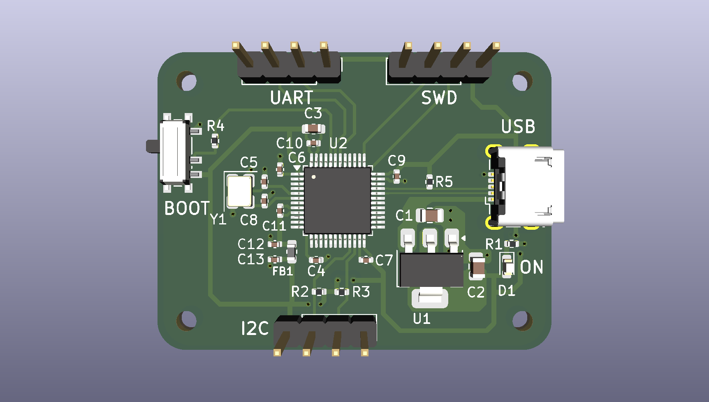
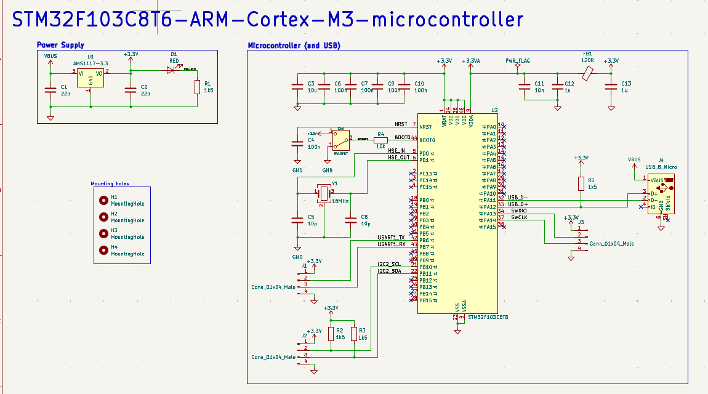

# STM32 Demo PCB

STM32F103C8T6 breakout board — USB-powered, SWD/UART/I2C headers, 41 × 31 mm, 2 layers. KiCad 10.



**Rev 0.1** · Status: [FILL: designed / fabricated / tested]

## Specs

- **MCU:** STM32F103C8T6, Cortex-M3 @ 72 MHz, 64 KB flash, 20 KB RAM, LQFP-48
- **Clock:** 16 MHz HSE crystal (3225), 2× 10 pF load caps
- **Power:** 5 V USB VBUS → AMS1117-3.3 LDO (1 A, SOT-223), 22 µF in/out
- **Decoupling:** 5× 100 nF (0402) + 10 µF bulk on VDD
- **VDDA:** filtered via 120 Ω ferrite bead + 10 nF + 1 µF
- **USB:** full-speed device on PA11/PA12, 1.5 kΩ D+ pull-up
- **Boot:** SPDT slide switch on BOOT0 via 10 kΩ
- **I2C pull-ups:** 1.5 kΩ to 3.3 V
- **Indicator:** red power LED (0603), 1.5 kΩ (~1 mA)
- **Mounting:** 4× 2.1 mm holes (M2), 3 mm corner radius

## Schematic



## PCB

| Parameter | Value |
| --- | --- |
| Size | 41 × 31 mm |
| Stackup | 2-layer, 1.6 mm FR4, 35 µm Cu |
| Bottom layer | Solid GND pour |
| Min track / clearance | 0.2 / 0.2 mm |
| Power tracks | 0.5 mm |
| Vias | 0.6–0.7 mm / 0.3 mm drill |
| Components | 28 parts + 4 mounting holes, all top side |
| Passives | 0402 / 0603 / 0805 |

## Pinout

All headers 1×4, 2.54 mm. Pin 1 = square pad.

| Header | Pin 1 | Pin 2 | Pin 3 | Pin 4 |
| --- | --- | --- | --- | --- |
| SWD (J3) | 3.3 V | SWDIO / PA13 | SWCLK / PA14 | GND |
| UART (J1) | 3.3 V | TX / PB6 | RX / PB7 | GND |
| I2C (J2) | 3.3 V | SCL / PB10 | SDA / PB11 | GND |

- UART uses remapped USART1 — set `AFIO_MAPR_USART1_REMAP` in firmware.

## BOM

| Ref | Qty | Value | Package |
| --- | --- | --- | --- |
| U2 | 1 | STM32F103C8T6 | LQFP-48 |
| U1 | 1 | AMS1117-3.3 | SOT-223 |
| Y1 | 1 | 16 MHz | 3225-4 |
| J4 | 1 | Micro-USB B (Würth 629105150521) | SMD |
| J1–J3 | 3 | 1×4 header | 2.54 mm THT |
| SW1 | 1 | SPDT slide (C&K PCM12) | SMD |
| D1 | 1 | Red LED | 0603 |
| FB1 | 1 | 120 Ω ferrite | 0603 |
| C1, C2 | 2 | 22 µF | 0805 |
| C3 | 1 | 10 µF | 0603 |
| C4, C6, C7, C9, C10 | 5 | 100 nF | 0402 |
| C5, C8 | 2 | 10 pF | 0402 |
| C11 | 1 | 10 nF | 0402 |
| C12, C13 | 2 | 1 µF | 0402 |
| R1–R3, R5 | 4 | 1.5 kΩ | 0402 |
| R4 | 1 | 10 kΩ | 0402 |

- LCSC part numbers included — ready for JLCPCB assembly.
- Full files: `STM32-BOM.csv`, `STM32-all-pos.csv`

## Files

```
STM32.kicad_pro / .kicad_sch / .kicad_pcb   KiCad project
STM32-BOM.csv, STM32-all-pos.csv            BOM + pick-and-place
629105150521 (rev1).stp                     USB connector 3D model
manufracture/                               Gerbers + drill
images/                                     Render + schematic
```

## Programming

- **SWD:** ST-Link V2 → J3. Flash with STM32CubeProgrammer or OpenOCD.
- **Bootloader:** BOOT0 = 1 enters the ROM bootloader, but it listens on PA9/PA10, which are not broken out — use SWD.

## Known Issues / Rev 0.2

- No ESD protection or fuse on USB VBUS
- USB shield unconnected
- No reset button

## License

[CERN-OHL-P-2.0](https://ohwr.org/cern_ohl_p_v2.txt) — permissive open hardware license. See `LICENSE`.
